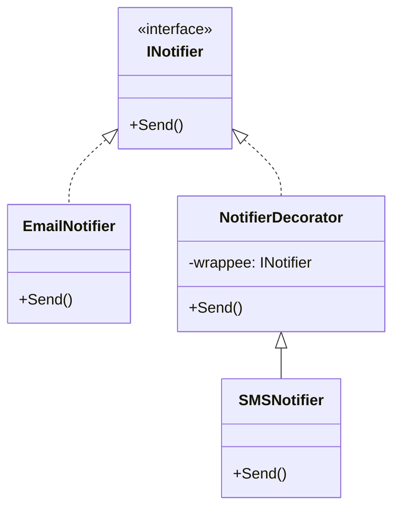
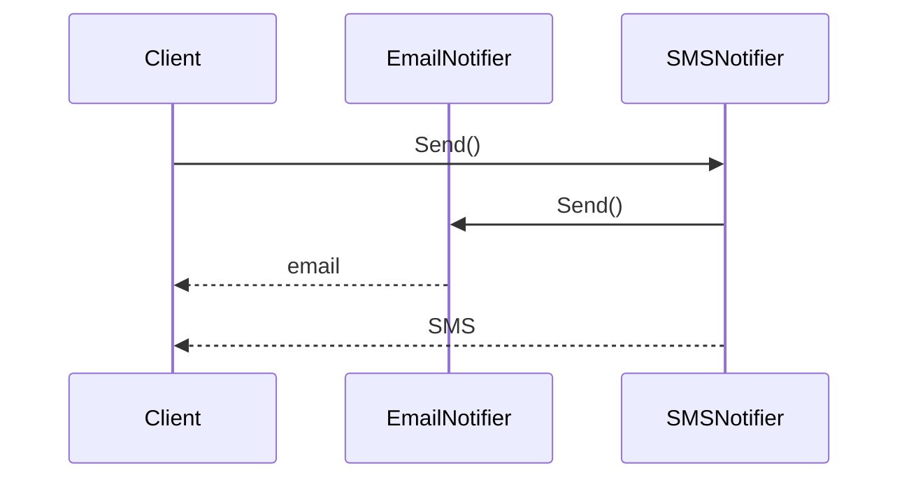

## 🔷 2. Decorator
**Тип:** Structural  
**Призначення:** Розширення поведінки об’єктів без зміни їхньої структури.

### UML - класів

```mermaid
classDiagram
    class INotifier {
        <<interface>>
        +Send()
    }
    class EmailNotifier {
        +Send()
    }
    class NotifierDecorator {
        -wrappee: INotifier
        +Send()
    }
    class SMSNotifier {
        +Send()
    }
    INotifier <|.. EmailNotifier
    INotifier <|.. NotifierDecorator
    NotifierDecorator <|-- SMSNotifier
```

### UML - послідовності

```mermaid
sequenceDiagram
    participant Client
    participant EmailNotifier
    participant SMSNotifier
    Client->>SMSNotifier: Send()
    SMSNotifier->>EmailNotifier: Send()
    EmailNotifier-->>Client: email
    SMSNotifier-->>Client: SMS
```
